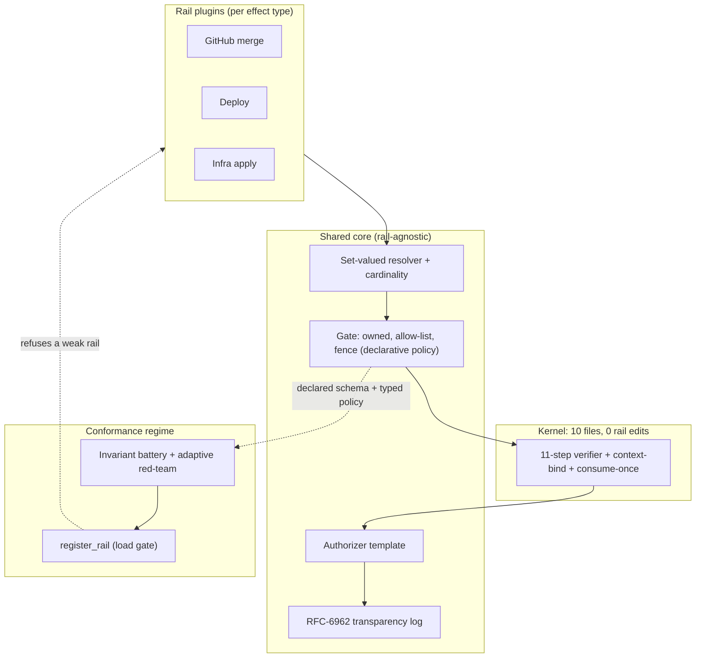

# Architecture

Signet has two layers, and the boundary between them is the whole point. A **kernel** decides whether an action is authorized and, if so, mints a signed one-time token for it. A **rail plugin** turns that token into a rail-specific capability — concluding a GitHub check, opening a deploy gate, applying an infra change. The kernel never learns what a rail is. Adding a rail is writing a plugin; it has never required touching the kernel, and the conformance suite refuses to load a plugin that would weaken the guarantee.

## Plan before you read untrusted data

The single most important structural choice: the authorized envelope is derived from **trusted instructions, frozen before the agent touches any untrusted runtime data.** The operator's mandate — the criterion and the policy scope — is loaded first and never sourced from a PR body, an issue, a plan file, or anything the agent fetched. The effective fence is `standing_policy ∩ task_mandate`, and that intersection only ever *narrows*: a task can add restrictions, never widen them. This is what makes injection a containment problem rather than an authorization problem — by the time the agent reads attacker-controlled text, the fence it has to stay inside is already fixed.

## The kernel pipeline, and why the order matters

The verifier runs eleven checks in a deliberate order. The order is load-bearing, not cosmetic:

1. **Signatures** — verify every mandate signature first, before anything stateful. This is the cheap-DoS guard: junk requests can't flood the consume-once registry because they're rejected before they reach it.
2. **Chain linkage** — Intent → Cart → Payment must hash-link correctly (each carries the prior's hash).
3. **Agent identity** — the acting agent matches the one the Intent authorized.
4. **Action allowed** — the action is in the Intent's allow-list.
5. **TTL / freshness** — checked against the *verifier's* clock, never a client-supplied timestamp. A client can't extend its own window.
6. **Revocation** — the mandate hasn't been revoked.
7. **Context binding** — the runtime context hash must equal the context the Cart committed to. This is what catches recipient/destination/merchant substitution and cross-context replay: the agent presents what it's *about* to do, and it has to match what was approved, field for field.
8. **Exactness** — runtime amount/currency equals the Cart, the Cart is within the Intent's cap, and the recipient is on the Intent's allow-list. (Steps 7 and 8 together are "the exactness step" — 7 catches *who/where*, 8 catches *how much*.)
9. **Policy** — caps, allow-list, currency, velocity, human-approval thresholds.
10. **Atomic consume-once** — keyed on the `chain_hash` (the exact bound transaction), this is the *last* gate before a token is issued. Replaying the identical transaction is rejected; distinct carts under one Intent are still allowed. Keying it on the chain rather than the Intent nonce is what makes multi-step mandates work without opening a replay hole.
11. **Record spend, sign the token** — velocity spend is recorded **per principal**, not per mandate. Per-mandate accounting would let an attacker structure a large transfer across many small mandates; per-principal aggregation closes that.

Two invariants run underneath all of it. **Fail closed:** any check that can't be satisfied blocks; there is no best-effort path. **Trust only the token:** nothing downstream acts on the agent's word or the raw mandate — only on a verified `ExecutionToken`.

## Resolution: a quarantined model that proposes, never decides

Picking *which* target a criterion refers to often needs judgment a deterministic rule can't supply ("the PR that fixes the double-charge bug"). That judgment is the one place an LLM earns its keep — and the one place injection lives. So resolution is split:

- **Role A (trusted)** interprets the operator's criterion *only*. It never sees runtime data, and it's deterministic — no prompt surface means no injection surface.
- **Role B (quarantined)** sees the candidates and their untrusted data and proposes matches. It runs one completion, no tools, and its output is clamped to `{owned candidate ids | unresolved}`.

The trick that makes Role B safe to be fallible is that **it returns a set, not a pick.** Asked "which one?", an LLM commits overconfidently and rarely abstains. Asked "which ones plausibly match?", a deterministic rule decides: exactly one survivor resolves, two or more escalates to a human, zero escalates. Ambiguity is a *count*, not a confidence score the model gets to fudge. A cheap deterministic pre-filter runs first — if two candidates structurally match a closing reference, it escalates before the model is even called. This came out of selective-prediction work: a structural abstention rule beats a confidence threshold, because the failure mode of these models is being confidently wrong, which no threshold catches.

Whatever Role B returns, **containment never depends on it.** The set runs through the gate and the kernel regardless, so a fully captured resolver (proven with an adversarial stub that always picks the attacker) is contained the same as an honest one.

## The gate and the declarative policy

Between resolution and the kernel sits the gate: `owned → allow-list → fence`, in that order, fail-closed on any stage. "Owned" is membership in the principal's candidates; "allow-list" is the configured universe ceiling (which repos, bases, services, accounts); "fence" is the scope/protected check. The ordering and the fail-closed live in **one shared function** — a rail supplies the predicates, not the control flow, so it can't reorder the stages or fail open on one.

The fence and allow-list are not rail *code* — they're rail **data**. Each rail declares a typed `CandidateSchema` (each attribute is `BOOL`, `CATEGORICAL(universe)`, or `NUMERIC(lo, hi)`, tagged `OWN` or `UNTRUSTED`) and a `PolicySpec`: a set of typed conditions (`IN_SET`, `LE`, `==`, …) over those attributes. A single shared evaluator decides. Three consequences fall out: a rail can't write a fail-open fence (there's no fence code to get wrong); a fence can't read an attribute it didn't declare (the projection only exposes the declared schema), and `register_rail` *refuses* a condition over an `UNTRUSTED` attribute — so the policy structurally cannot depend on attacker-controlled data; and the entire security policy of every rail is a small piece of data the scorecard renders and diffs run-over-run, so a loosened cap or a removed condition is an alarm, not a silent change. What no mechanism can know — whether the *declared* policy is the *intended* one — collapses to a one-screen review because the policy is data.

## The authorizer template

The authorizer is the only thing that can produce a rail capability, and it's a template, not a free function: `verify_token → recheck_against_context → produce_capability`. The base class runs the token check and an independent re-check (re-derive the effect from the runtime context, confirm it matches what the token bound) *before* any rail code runs. A rail fills in the re-check predicate and the capability step; it physically cannot skip the token verification or the re-check, because the template owns that flow. This is the second containment layer below the kernel: even a rail authorizer that tried to mint unconditionally is stopped on an invalid token or a context mismatch.

## How containment is inherited, verified, and made mandatory

A rail is a plugin: an effect-key encoding, a typed schema + policy, a `project()` from its domain object to that schema, an authorizer, and the Role A/B bindings. Everything containment-critical — the gate, the cardinality rule, the clamp, the authorizer template, the chain verifier, the transparency log — is shared and inherited, not re-implemented. Across three structurally different rails (a boolean path fence, a boolean protected-env + scalar artifact key, and a *quantitative* blast-radius fence + *set-valued* resource key) the fresh per-rail code is domain glue; no rail has written new containment logic.

Inheriting the guarantee isn't enough on its own, so a **conformance battery** verifies each plugin satisfies it: seven invariants — gate property, fail-closed, authorizer-template, bounded-to-own, cardinality, effect-key binding, schema clamp — checked over a generated cross-product of candidate worlds and adversarial resolver outputs, sweeping the full declared schema. `register_rail` runs it synchronously and **refuses to load a non-conformant rail**, so a weak gate is a load-time error, not an author's responsibility to avoid. An adaptive red-team (an attacker model writing untrusted candidate fields to maximize the chance of an off-fence endorsement) is the empirical complement: its job isn't to fool the model — that's expected — but to find an *input* that escapes containment. A breakout would mean the battery's enumerated output space had a hole; the two cross-check each other.

## The audit log

Every decision — allow, block, or escalate — appends a hash-chained signed receipt and a structured `DecisionRecord` to an RFC-6962 Merkle log. An auditor verifies a single decision from `(record, inclusion proof, signed tree head, pinned key)` alone, with no access to the running system, which is what defeats after-the-fact equivocation. Role B's reasoning narrative is hashed and only the *hash* is anchored — the trace is tamper-evident but its content never enters the log. The receipt carries a `decision_record_hash` backlink (the single additive field the kernel gained), so a receipt traveling on its own is self-describing.

## What's deliberately not in the kernel

The kernel doesn't try to detect prompt injection, doesn't reason about rails, and doesn't patch the threats that belong upstream — a correctly-signed but malicious chain (mitigated by human-present thresholds at signing time), principal key compromise, agent–merchant collusion. Several primitives are proof-of-concept and isolated for swapping: Ed25519 (→ ECDSA P-256 for AP2 verifiable credentials), sorted-keys JSON (→ RFC 8785 JCS), single-process SQLite consume-once (→ a multi-instance atomic store), and a local append-only anchor (→ a real immutable log). Each is one file; none is in the decision path's logic, only its primitives.