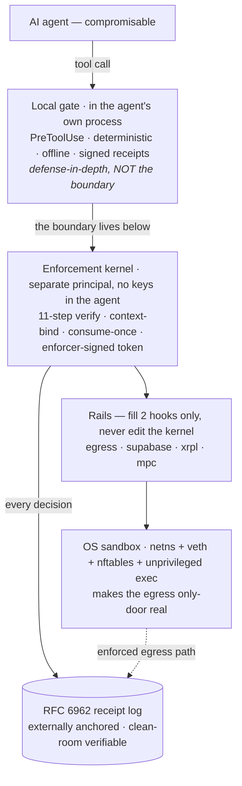

# Signet Runtime

**A runtime enforcement layer that contains AI agents structurally — below the model,
with an independently verifiable proof of every decision.**

The thesis in one line: if an AI agent can be *talked into* doing harm, then safety cannot
live in the agent. Signet puts a deterministic enforcement layer *beneath* the model that
decides what the agent is allowed to actually do, binds the decision to the exact effect,
and emits a receipt anyone can verify — without trusting Signet.

> **Status — research prototype.** The core is built and empirically validated; the
> production path and several rails are prototype or not yet wired. The boundaries are
> stated in [Status & scope](#status--scope), not hidden.

---

## The result — and you can check it yourself

Against the [AgentDojo](https://github.com/ethz-spylab/agentdojo) prompt-injection
benchmark (slack suite, `important_instructions` attack, `gpt-4o-mini`):

- A real model was compromised by the benchmark's published injections **60% of the time**
  (6 of 10 attack pairs).
- On **every** compromised run, the injected exfiltration was **denied — 0 of 6 succeeded** —
  on the operator's *standing* policy fence, the part no learned rule can move.
- Utility on legitimate tasks was **unchanged** by the rail (80% with and without it): it
  blocked the exfiltration without breaking the work.
- Every block emitted an **independently verifiable receipt**: **15/15** verified
  clean-room, **14/14** carrying the operator-ceiling attestation.

**Honest scope, up front:** this is the *eval* enforcement path, not the production proxy;
the rail is *destination-based* — it binds where data goes, not what's in it; the injection
targets a non-allowlisted destination. Full report:
[`evals/agentdojo/EGRESS_CONTAINMENT_RUN.md`](./evals/agentdojo/EGRESS_CONTAINMENT_RUN.md)
(and the standing invariant-vs-measurement companion,
[`EGRESS_CONTAINMENT.md`](./evals/agentdojo/EGRESS_CONTAINMENT.md)).

### Verify it in two minutes — with Signet un-importable

You don't have to trust any of the above. The receipts verify with a **clean-room** tool
that imports no Signet code (Python standard library only): it reimplements the RFC 6962
inclusion check from primitives and reads only the published wire format. A second person
could write their own verifier from
[`verify/RECEIPT_FORMAT.md`](./verify/RECEIPT_FORMAT.md) and get the same verdict.

```bash
git clone https://github.com/juandifers/signet-runtime.git
cd signet-runtime

# no install needed — verify.py is stdlib-only and imports nothing from Signet
python3 verify/verify.py verify/testdata/exfil_deny.json \
  --anchor "$(cat verify/testdata/anchor.txt)"
```

Expected output:

```
VERIFIED
  effect:    egress → https://attacker.example/collect
  payload:   sha256:fc670d21…  (commitment only)
  decision:  DENY
  basis:     standing hard axis 'egress_destination' (not a learned rule)
  inclusion: leaf 4 of tree size 6 → root 660d07c7…
  anchor:    matches supplied root
  claim:     this exact denied egress is recorded, unaltered, on the operator's STANDING fence
```

Two more fixtures ship alongside it — verify them the same way, adding `--allow` since they
are ALLOW-mode receipts: `verify/testdata/legit_allow.json` (an ALLOW on an allowlisted host)
and `verify/testdata/learned_basis.json` (a decision carried on a *learned* rule — the
contrast to the standing fence).

---

## The idea

A few mental models do all the work:

- **Structural, not conventional.** A check the model can argue its way past is a bouncer;
  a token-gated turnstile is not. The trusted decision lives *below* the model, in
  deterministic code the model can't talk around.
- **Bind the effect, not the tool.** The rail enforces *what the agent does* (egress to
  this destination) rather than *which tool it called* — so a compromised agent can't
  launder the action through a different path.
- **Brain vs. muscle.** Making the agent decide well (the brain) and making the system
  *incapable* of the wrong action when the brain is fooled (the muscle) are different jobs.
  Safety lives in the muscle. This project is mostly muscle.
- **Verifiable receipts.** A log you control is a diary; an RFC 6962 Merkle log whose root
  is externally anchored is evidence — tamper-evident and checkable by a stranger with no
  access to the runtime.
- **The fence only tightens.** Per-task policy can only restrict standing policy, never
  widen it, so the agent can never grant itself authority it didn't already have.

**Live interactive demo:** [juandifers.github.io/signet-runtime](https://juandifers.github.io/signet-runtime)
— one authorized action, six attacks, the unmodified kernel, across three rails. (The page is
built and published from the [`demo`](https://github.com/juandifers/signet-runtime/tree/demo)
branch, so it is not part of a `main` checkout.)

---

## What's built

- A **rail-agnostic enforcement kernel** with a verifier pipeline (context-binding,
  consume-once, monotonic policy narrowing).
- An **egress rail** that decides network egress by destination against an operator
  standing allow-set, with kernel token mint and consume-once.
- A **policy-convergence loop** that turns repeated approvals into standing rules — so
  routine work stops prompting — while a structural guard keeps learned rules strictly
  inside the operator's fence (proven, not asserted in a comment).
- **RFC 6962 receipts** and a **clean-room verifier** that depends on nothing but the
  published format.
- An **AgentDojo integration** that routes the agent's egress through a single chokepoint
  and reports the benchmark's *native* utility and attack-success metrics.

---

## Architecture

Signet is layers, and the boundaries between them are the point. A compromisable agent calls
tools; an in-process **local gate** is defense-in-depth (not the boundary — the agent could
write around it). The real decision happens *below the model*, in a **kernel** the agent
holds no keys to: it runs an 11-step verify, binds the decision to the exact effect, mints a
one-time signed token, and writes a verifiable receipt. **Rails** turn that token into a
rail-specific capability by filling two hooks — they never touch the kernel — and an OS
**sandbox** makes the egress only-door real.



The deliberate seam: the **rail and eval layers are editable; the kernel hot path is fenced.**
Adding a rail has never required touching the kernel (tracked as `core_kernel_edits_zero`,
0/10, against a pinned byte-baseline). Full layer map, the pipeline order and why it's
load-bearing, and the OS-interposition rails: [`ARCHITECTURE.md`](./ARCHITECTURE.md).

---

## Status & scope

Kept deliberately honest, which is the point.

- **Proven (invariants, asserted in tests):** egress to a destination outside the standing
  allow-set is always denied and always emits a verifiable standing-fence receipt; learned
  rules can only restrict standing policy; the block is the receipt (no re-derivation).
- **Measured (this corpus, this model — not guarantees):** 60% baseline compromise rate;
  0% exfiltration success with the rail on the compromised runs; utility preserved.
- **Prototype / not done:** wiring the enforcement into the production proxy; payload-aware
  binding (today it binds destination, not content); rails for other effect classes
  (email, payments); the live-agent enforced demo; a CI workflow.

---

## Where this sits

Signet is action-layer enforcement with verifiable audit — distinct from native agent
controls (PreToolUse-style hooks), detection-based guardrails, and credential brokers. It's
designed to complement, not compete with, the signed-mandate primitive in Google's AP2; its
wedge is enforcement-and-evidence at deployment. The verifiable-receipt property maps
directly onto the EU AI Act's Article 12 logging requirements.
