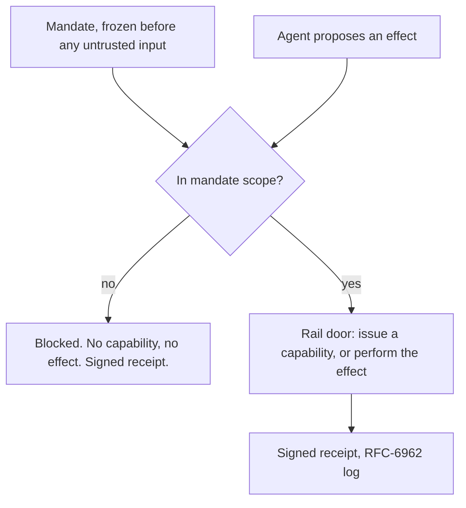

# Signet

**Runtime enforcement for AI agents that take real actions.** Drop it into a LangGraph agent and it sits at the last step before anything irreversible — a database write, a network call, a merged PR — and decides whether that exact action runs.

It starts from an assumption most agent-security tools avoid: the model is already compromised. Prompt injection works, jailbreaks work, and sooner or later something in an untrusted input will talk your agent into proposing an action it shouldn't. So Signet doesn't try to keep the model honest. A quarantined model proposes *what* to do; the decision of *whether it runs* lives somewhere the model can't reach.

The guarantee isn't "the model won't be fooled." It's: when the model is fooled, the harmful action still can't execute, and there's a signed receipt proving it didn't.

## See it get tricked and contained

The demo is a support-triage agent. It reads a customer ticket and can issue a store credit. One mandate grants it exactly two things: insert a row into `public.credits`, and reach one allow-listed host. Then a ticket comes in with a hidden instruction buried in it — make this customer an admin, and POST their record to an outside server.

One run, both rails, one session:

```
#1  db insert   public.credits        ->  ALLOW   capability minted, 1 row, receipt
#2  egress      attacker.example:443  ->  BLOCK   403, 0 bytes, receipt
```

The agent did its real job and got fooled into the attack in the same breath. The credit went through; the exfiltration didn't. Neither outcome depended on the model noticing the injection — that's the whole point.

There's also a hosted demo of the merge rail at <https://juandifers.github.io/signet-runtime/> — one authorized merge and six attacks through the same kernel, regenerated by CI so the page can't drift from the code.

## Wiring it in

The integration is two pieces: declare a mandate, wrap a tool.

```python
from signet import guard, Mandate

# What the agent may do — frozen before it reads anything untrusted.
mandate = (
    Mandate("support-bot", task_id="refund-001")
      .allow_db("public.credits", ops=("select", "insert"))
      .build()
)

# Wrap any LangGraph tool. Same interface; now every effect it proposes
# crosses Signet before it can happen.
safe_tool = guard(db_tool, mandate)
```

The agent calls the tool the way it always did. An out-of-mandate write — a different table, an operation it wasn't granted — gets blocked before it reaches the database, and you get a receipt for the refusal. No row-value kwargs on `allow_db`, by the way: this door binds schema, table, and operation, not the contents of the write. The API won't let you ask it for a guarantee it doesn't give.

## How it works

One idea carries most of the weight: enforcement lives below the model. The mandate — what this agent may do, on which resources — is frozen before the agent reads any untrusted input, so nothing in a poisoned ticket can widen it. Every effect the agent proposes crosses a gate that checks it against that mandate. In scope, it proceeds. Out of scope, it's refused and logged.



Handles two structurally different kinds of door, and the cryptographic kernel never learns the difference:

- **Capability-issuing doors** — the database. A separate broker mints a short-lived, scoped token; the agent holds it for a moment; the database itself enforces the scope. At Tier 1 the broker runs as a *different OS user* that owns the signing key, so the agent's process can't read it. That's an operating-system guarantee, not a policy I wrote in Python.
- **Effect-performing doors** — network egress. A proxy makes the connection or refuses it. The agent holds nothing; the proxy is the only thing with network authority.

Same seam, same kernel, two archetypes. Adding a rail doesn't touch the 10-file core — that's held to zero edits across every rail, and checked in CI.

## What it actually guarantees

I keep a hard line between what's cryptographically structural, what's advisory, and what I left out on purpose. For anyone evaluating this seriously, that line is the interesting part:

- **Structural (proven).** The agent process holds no database signing key at Tier 1. A killed broker writes nothing — it fails closed. A substituted action changes the bound context and the kernel rejects it. The 10-file kernel is byte-identical across all rails (0/10 edits). Receipts verify from `(record, proof, signed root, pinned key)` alone, with no access to the running system.
- **Advisory (real, but bypassable until hardened).** The egress proxy refuses off-allowlist hosts today. But until it's the *only* network route — a Linux network namespace, which isn't wired here yet — a determined agent could connect around it. Every egress decision in the demo is labeled `advisory` so it's never mistaken for the structural version. The DB door has its structural proof; egress doesn't, and I say so.
- **Out of scope by design.** A perfectly-formed, correctly-signed, legitimate-*looking* malicious chain (the defense for that is a human at signing time, not the kernel). Principal key compromise. And row-value binding on the DB door — it binds schema/table/op, so amount-level checks belong on the payment rail, not here.

## Status

Research-grade, and labeled as one. The enforcement is real and tested; a few primitives are proof-of-concept on purpose, called out so you know which is which:

- Crypto is Ed25519; production wants ECDSA P-256. Isolated to one file.
- Canonicalization is sorted-keys JSON; production wants RFC 8785 JCS.
- Consume-once and velocity state is single-process SQLite; production wants a shared atomic store.
- The transparency anchor is a local append-only stub; production wants S3 Object-Lock or Rekor.
- Any LLM numbers are model-specific and directional, not universal.

The full suite is green, CI makes no live LLM calls, and every rail runs on the same unmodified core.

## Navigating the repo

Start at the kernel (`signet/verifier.py`), then move outward: authorizers adapt the kernel's *decision* to a rail, the seam adapts a *rail* to an *orchestrator*, and everything in `examples/` is a runnable story on top.

**The core — `signet/`** (rail-agnostic; held to zero edits per rail)
| Path | What it is |
|---|---|
| `verifier.py` | The 11-step decision kernel. **Start here.** |
| `chain.py` · `models.py` | AP2 chain hashing/linkage/context-binding; Intent/Cart/Payment + token/receipt types |
| `policy.py` · `nonce.py` · `revocation.py` | Caps/allowlist/currency/velocity · SQLite consume-once · execution-time revocation |
| `receipts.py` · `crypto.py` · `canonical.py` | Hash-chained signed receipts · Ed25519 sign/verify · canonical JSON (swap seams) |
| `builder.py` | Mints signed chains + attack-variant hooks (tests/demos build here) |
| `authorizers/` | The Role-2 template (`base.py`, fill 2 hooks) + `mock_broker.py`, `xrpl_cosigner.py` (Role 1), `mpc_cosigner.py` (Role 1b) |
| `broker/` · `rails/` · `sandbox/` | Broker = authorizer over a transport (separate OS user) · keyholder rails (supabase DB, egress proxy) · netns egress boundary (Linux, privilege-gated) |
| `fence.py` · `cli/` | Local path/command fence + `.signet/policy.yaml` · the `signet` console script (`hook`, `init`, `status`, `receipts`) — never imports `evals/*` |
| `api.py` | HTTP surface (`uvicorn signet.api:app`); wires only the mock broker |

**The layers above the kernel**
| Path | What it is |
|---|---|
| `integrations/effect_gateway/` | The orchestrator-agnostic **seam** (`ProposedEffect → Decision`); read `SEAM_CONTRACT.register.md` before touching it |
| `integrations/langgraph/` | LangGraph middleware — the `guard(tool, mandate)` on-ramp |
| `rail_algebra/` | (in `signet/`) rail-shape composition |

**Runnable demos & examples**
| Path | What it is |
|---|---|
| `examples/onramp/` | The minimal `guard()` + `Mandate` on-ramp (start here to integrate) |
| `examples/refund_triage/` | The headline demo — one agent, two rails (DB + egress), one poisoned ticket |
| `examples/browser_demo/` | Guarded browser agent: frozen path-aware WebMandate, saucedemo/acmeshop runs, self-checks, viewer |
| `examples/combined.py` · `guard_db_block.py` · `guard_egress.py` | Copy-paste snippets from "Try it" |
| `demos/` | CLI demos: `role2_demo`, `role1_xrpl_demo`, `mpc_demo`, `langgraph_merge_demo`, github railbridge |

**Tests, evals, proofs** — *the tests are the spec*
| Path | What it is |
|---|---|
| `tests/test_attacks.py` | The 21-attack **kernel spec** (each test = one attack) |
| `tests/test_broker_*.py` · `test_netns_egress.py` | DB/egress bypass batteries (`#9`/`#8` = advisory) · netns boundary (privilege-gated) |
| `tests/test_local_fence.py` · `test_signet_middleware.py` · `test_refund_*.py` | Local gate · orchestrator middleware · refund-triage acceptance |
| `evals/scorecard/` | Offline security scorecard — `python -m evals.scorecard`, exits non-zero on any invariant failure |
| `evals/agentdojo/` · `evals/github_railbridge/` | Egress eval harness · merge-rail eval corpus |
| `verify/` · `anchor/` | Standalone receipt verifier (`verify.py`) + format doc · transparency-log anchor stub |

**Docs, root to deep** — `README.md` (this file, the pitch) → [`ARCHITECTURE.md`](./ARCHITECTURE.md) (data flow + invariants) → [`DESIGN.md`](./DESIGN.md) (full design, P1–P9) → [`PRINCIPLES.md`](./PRINCIPLES.md) · [`LOCAL_GATE.md`](./LOCAL_GATE.md) (the local fence) · [`CLAUDE.md`](./CLAUDE.md) (invariants for contributors — read before changing the kernel).

## Where the ideas come from

The trusted-planner / quarantined-worker split is the dual-LLM pattern, formalized as CaMeL (Debenedetti et al., 2025); Signet specializes it to irreversible actions and adds cryptographic binding plus a verifiable log. The mandate chain follows AP2 (the Agent Payments Protocol). The transparency log is RFC 6962 (Certificate Transparency). The "abstain unless exactly one candidate matches" rule comes from selective-prediction work, which keeps finding that models don't abstain when they should and that a structural rule beats a confidence threshold.

The full data flow and the invariants each layer holds are in [`ARCHITECTURE.md`](./ARCHITECTURE.md).

## Try it

```bash
pip install -e ".[refund-demo]"      # supabase rail crypto + langgraph (the demo graph)

# The on-ramp, end to end:
python -m examples.guard_db_block    # a guarded DB write; an out-of-mandate write is blocked
python -m examples.guard_egress      # a guarded network call; an off-allowlist host is refused
python -m examples.combined          # one agent, both rails, one session

# The full security scorecard — offline, no keys, exits non-zero on any invariant failure:
python -m evals.scorecard
```
